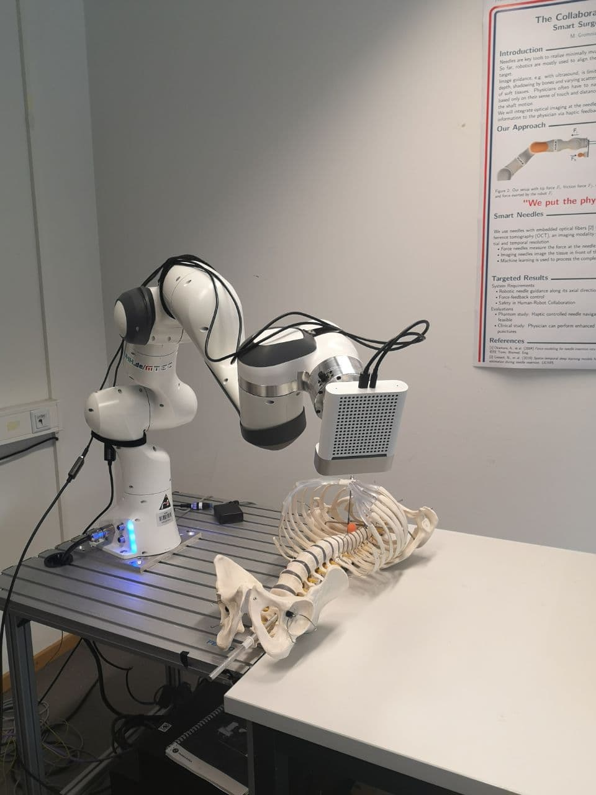
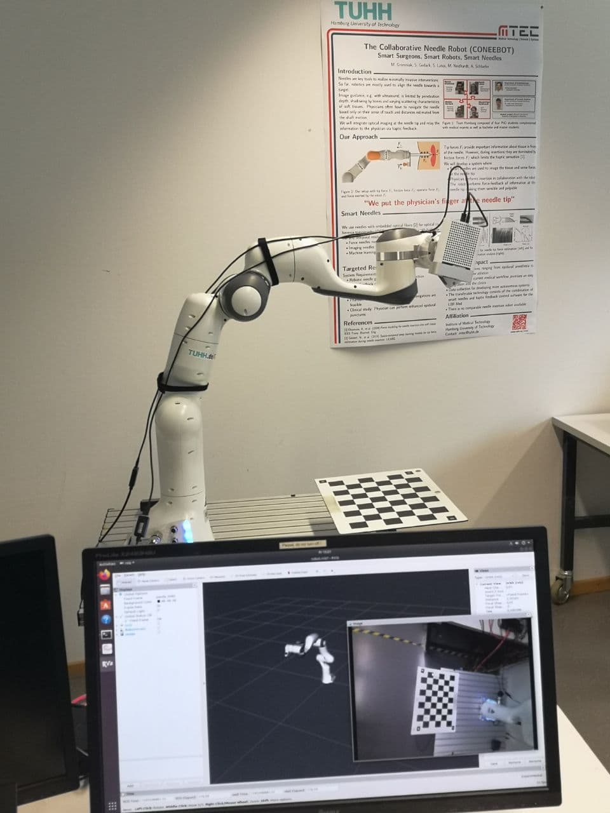

# TUHH_RNM_Project

### Group Project: Image Guided Robotic NeedlePlacement

   

### [Project Description](https://github.com/adamanov/TUHH_RNM_Project/blob/master/documentation/ProjectDescription2020_update080520.pdf)
### [Project Plan](https://github.com/adamanov/TUHH_RNM_Project/blob/master/documentation/RNM_ProjectPlan_Group2updated.pdf)
### [Project Report](https://github.com/adamanov/TUHH_RNM_Project/blob/master/documentation/RNM_Report_Group_2.pdf)

### Tasks: 

#### Task1: Robot kinematics

In the final application you will need to move the robot
• for recoding of poses for the hand-eye calibration
• for scanning the chest phantom from different sides
• for the needle insertion

### Task 2: Trajectory planning
In order to move the robot to a desired target it needed to send the robot a continous trajectory
of joint positions.

### Task 3: Camera calibration
The Kinect Azure has an RGB and a depth camera. The calibration of the Kinect had to be 
done so that it captures the true geometries of the world.

### Task 4: Eye-in-hand calibration
In order to stich the pointclouds of the chest phantom, it is needed to know the transformation
between the mounted camera (”eye”) and the robot’s end effector (”hand”)

### Task 5: Model recording and registration
In order to obtain a 3D Scan of the chest phantom, the camera has to be driven around the phantom.
Based on given a 3D CAD model of phantom, the model registration had to be done. 
